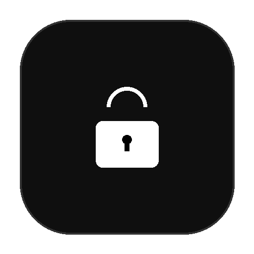

<p align="center">
  
</p>

<h1 align="center">Lock It</h1>

<p align="center">
  <strong>Focus & Productivity Menu Bar App for macOS</strong>
</p>

<p align="center">
  Create customizable focus profiles that arrange your apps, play ambient sounds, and eliminate distractions — all from the menu bar.
</p>

---

## Features

### Focus Profiles
- Create unlimited custom focus profiles with name, description, and personalized setup
- **Desktop Arrangement** — organize apps across multiple macOS Spaces with fullscreen, split-view, or custom layouts
- **Background Sounds** — ambient audio (Rain, River Stream, Forest Birds) with per-profile volume control
- **Grayscale Mode** — automatically convert screen to grayscale to reduce visual distractions
- **Close Other Apps** — quit non-essential apps when a session starts

### Session Management
- One-click session activation from tray popup
- Live elapsed timer display (MM:SS / HH:MM:SS)
- Mid-session volume control
- Confirmation dialog before stopping

### Statistics
- Total sessions, focus time, and day streak
- Weekly activity bar chart
- Per-profile time breakdown
- Recent session history

### Settings
- Auto-launch on macOS login
- Dark / Light theme toggle
- Reset all data

---

## Tech Stack

| Layer | Technology |
|-------|-----------|
| UI | Vue 3 |
| State | Pinia |
| Build | Vite |
| Desktop | Electron |
| Packaging | electron-builder |
| Platform | macOS (AppleScript automation) |

---

## Project Structure

```
lock-it/
├── src/
│   ├── views/           # HomeView, ProfileEditor, Stats, Settings
│   ├── components/      # TimerDisplay, ModeCard, NavBar, DeleteModal
│   ├── stores/          # settings, timer, stats, session (Pinia)
│   └── services/        # Timer, Audio, Grayscale, AppLauncher, Settings
├── electron/
│   ├── main.js          # Tray, window, IPC handlers, AppleScript
│   └── preload.js       # Context bridge (window.lockIt)
├── build/               # App icon, tray icon
└── vite.config.mjs
```

---

## Getting Started

### Prerequisites
- **macOS** (required — uses native AppleScript automation)
- Node.js 18+

### Install & Run

```bash
# Install dependencies
npm install

# Development (Vue hot-reload + Electron)
npm run dev

# Production build (DMG)
npm run build:dmg
```

### Scripts

| Command | Description |
|---------|-------------|
| `npm run dev` | Start Vite dev server + Electron |
| `npm run build:vue` | Build Vue frontend |
| `npm run build:mac` | Build macOS app |
| `npm run build:dmg` | Build DMG installer |

---

## How It Works

1. **Create a profile** — pick apps, arrange desktops, choose ambient sound
2. **Click "Start"** — Lock It launches your apps in the configured layout, enables grayscale, starts the timer, and plays audio
3. **Focus** — the timer runs in the menu bar popup while you work
4. **Stop** — session stats are saved and your environment returns to normal

---

## License

Private project.
