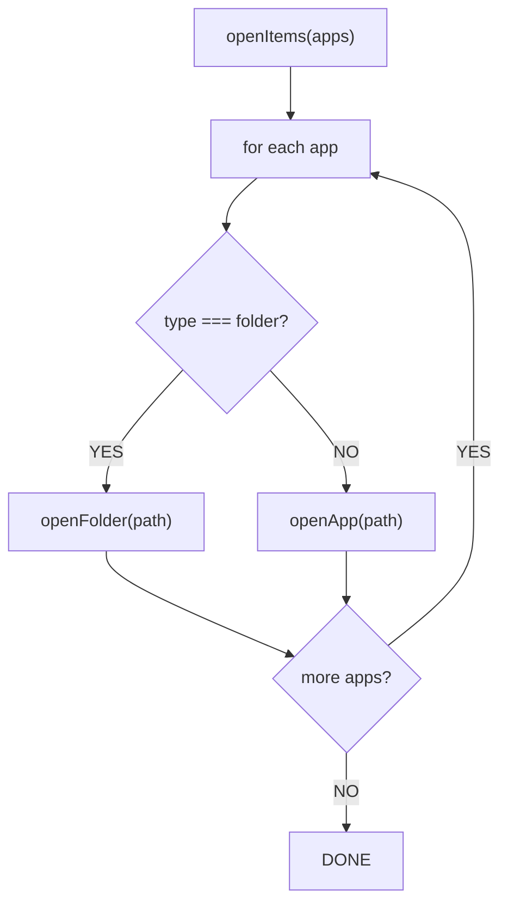
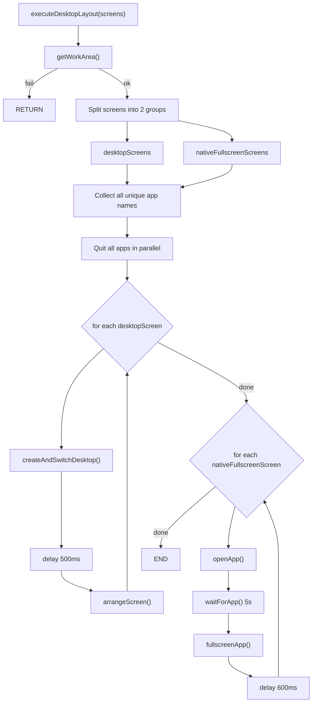
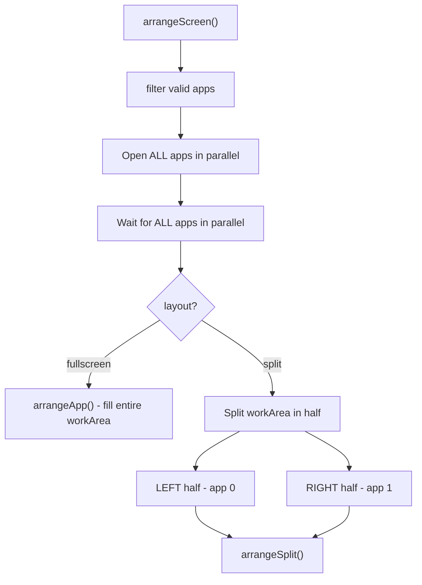
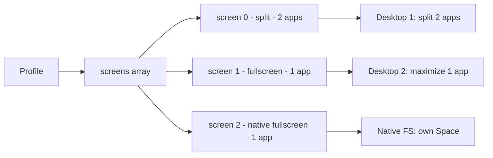
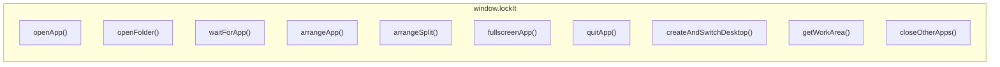

# AppLauncherService - Flow Chart

## 1. openItems - Simple Open

---

## 2. executeDesktopLayout - Main Flow

---

## 3. arrangeScreen - Internal Helper

---

## 4. Data Flow

---

## 5. IPC Calls

