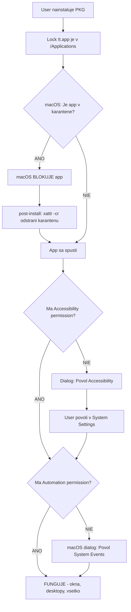
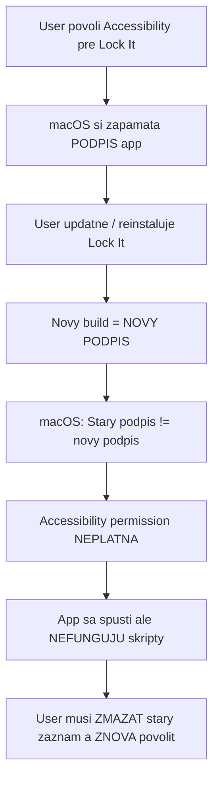
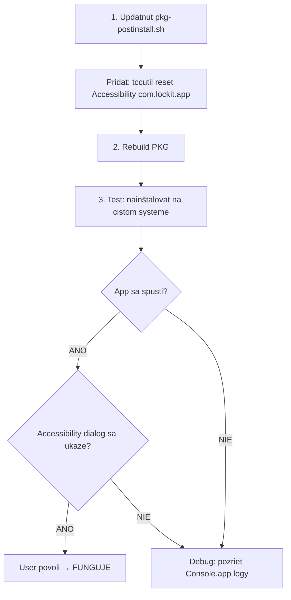

# Lock It - Instalacka: Problemy a Riesenia

## Co sa deje po instalacii (preco to nefunguje)



---

## Klucovy problem: Accessibility permission sa viaze na CODE SIGNATURE



**Toto je ten problem** - po kazdej reinstalacii sa meni podpis a macOS zrusi permission.

---

## Co vieme spravit (moznosti)

### Moznost 1: Post-install script ktory resetne permissions (JEDNODUCHE)

```
PKG post-install script:
1. xattr -cr /Applications/Lock It.app          (odstrani karantenu)
2. tccutil reset Accessibility com.lockit.app    (resetne stary permission zaznam)
```

Po spusteni app znova vyziada Accessibility → user povoli → funguje.

**Vyhoda:** Jednoduche, funguje vzdy
**Nevyhoda:** User musi po kazdej instalacii znova povolit Accessibility (1x kliknut)

### Moznost 2: Apple Developer Account + Notarization (PROFESIONALNE)

```
1. Kupit Apple Developer Account ($99/rok)
2. Podpisat app s Developer ID certifikatom (stabilny podpis)
3. Notarizovat cez Apple
```

**Vyhoda:** Ziadne warnings, stabilny podpis = permission prezije update
**Nevyhoda:** Stoji $99/rok

### Moznost 3: Konzistentny ad-hoc podpis (KOMPROMIS)

```
1. Vygenerovat self-signed certifikat v Keychain Access
2. Pouzivat tento certifikat na podpisovanie
3. Podpis zostava rovnaky medzi buildami
```

**Vyhoda:** Zadarmo, permission prezije update (ak sa certifikat nemeni)
**Nevyhoda:** Stale macOS warning pri prvej instalacii

---

## Aktualny stav a co opravit

| Vec | Stav | Treba |
|---|---|---|
| PKG instaluje do /Applications | OK | - |
| Karantena sa odstrani (xattr -cr) | OK | - |
| Entitlements (JIT, AppleEvents) | OK | - |
| Code signing (ad-hoc) | OK | - |
| Accessibility reset po reinstall | CHYBA | Pridat tccutil do post-install |
| Automation permission (System Events) | CIASTOCNE | Vyziada sa ale az po Accessibility |

---

## Odporucany plan


